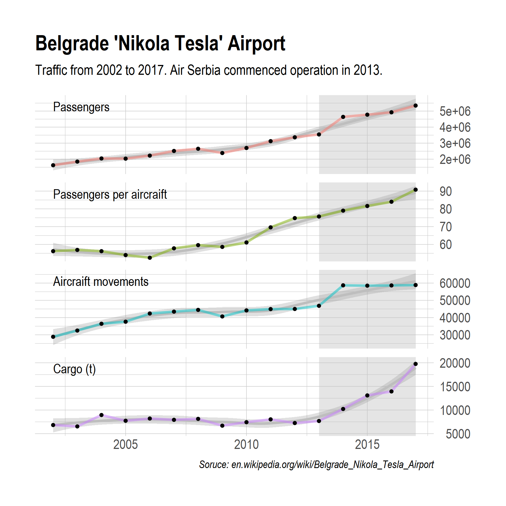
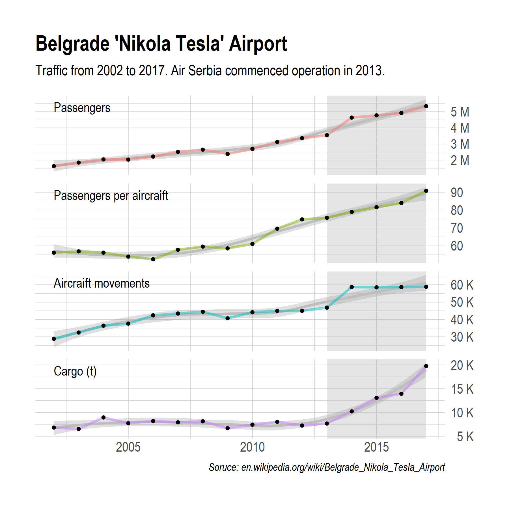

Few functions
================

These are few functions I used at some point for something–for some of
them, there are probably much better packages.

# Mean on at least (average-excluding.R)

More details here: <https://mdjeric.github.io/f-mean-on-at-least.html>
Does the same thing as SPSS `mean.#`. Calculates mean of a case if more
than n values are not NA, otherwise returns NA. Handy for making indexes
of several variables when you can specify to calculate it if e.g. more
than 75% or 90% of values are present in each case.

## Sample

Doing a simple sample, six variables, each case has different number of
missing values.

``` r
DF <- data.frame(var_1 = c(10, 20, 30, 40, 50),
                 var_2 = c(11, 21, 31, 41, NA),
                 var_3 = c(12, 22, 32, NA, NA),
                 var_4 = c(13, 23, NA, NA, NA),
                 var_5 = c(14, NA, NA, NA, NA),
                 var_6 = c(NA, NA, NA, NA, NA)
                 )

DF$av_miss_2 <- average_excluding(DF[, 1:6], 2)
DF$av_miss_5 <- average_excluding(DF[, 1:6], 5)

DF
```

    ##   var_1 var_2 var_3 var_4 var_5 var_6 av_miss_2 av_miss_5
    ## 1    10    11    12    13    14    NA      12.0      12.0
    ## 2    20    21    22    23    NA    NA      21.5      21.5
    ## 3    30    31    32    NA    NA    NA        NA      31.0
    ## 4    40    41    NA    NA    NA    NA        NA      40.5
    ## 5    50    NA    NA    NA    NA    NA        NA      50.0

And this is how it comes in the end. We have means for cases which have
no more than two missing values, and no more than five missing values.

# Scaling thousands and millions (scaling-axis-ggplot2.R)

This one has probably even more unique/rare appliation. We don’t want to
mix different “units”, and an axis that would include from 100s to
1,000,000s, well this wouldn’t be a helpful way.

But, it solved a problem in faceting data for Belgrade Airport which
included number of passengers, plane operations, cargo, and passengers
per airplane to be presented in one plot with numbers formated in a
clean way.

``` r
library(ggplot2)
library(scales)

imenuj <- function(x) {
  ifelse(x > 999999,
         paste(comma(x * 0.000001), "M"),
         ifelse(x > 999,
                paste(x * 0.001, "K"),
                paste(x)
                )
         )
}
```

Once it is included in gglpot labels option,

``` r
scale_y_continuous(labels = imenuj, position = "right")
```

the first graph becomes the second one. Much
better.




# Summaries (various-summaries.R)

*Samples coming soon*

These are 6 different functions that summarize data . Probably the most
useful are `info.detail`, `out.tbls.wn`, and `out.stat`.

First returns min , max, mean, SD, and number NAs, along with type of
variable and number of levels if factor in a data frame.

Second returns frequency, relative, and cumulative percent of for a
variable values, along with min, max, mean, and SD (prints notification
if it is a factor).

Third provides just min, max, mean, and SD for data frame.
